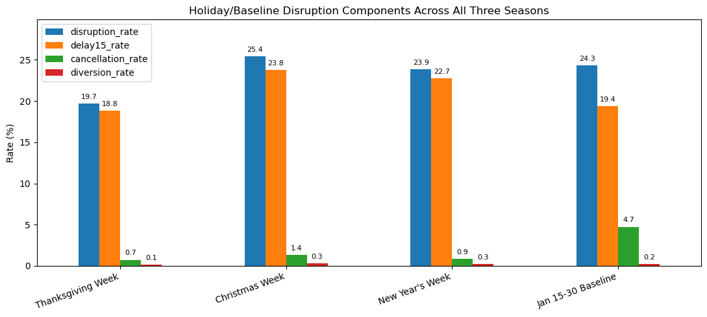
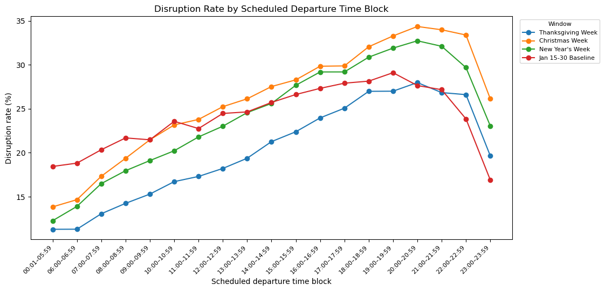
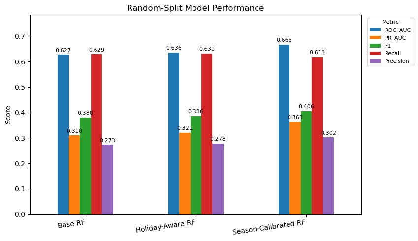

# Flight Disruption Risk Model
### Three-Season Holiday / Winter Operating Window Analysis

This project uses public BTS/DOT airline on-time performance data to evaluate flight disruption risk across three matched holiday/winter operating seasons:

- **2023–2024** — November 2023, December 2023, January 2024
- **2024–2025** — November 2024, December 2024, January 2025
- **2025–2026** — November 2025, December 2025, January 2026

The scope is deliberately controlled. Rather than modeling every month of airline operations, the analysis isolates the same November–January operating window across three seasons so that holiday timing, winter exposure, and seasonal recovery pressure can be compared on a like-for-like basis.

**Core question:** Across matched November–January operating windows, do scheduled flight characteristics, holiday-period context, and departure-time patterns identify higher-risk flights and operating windows before disruption is realized?

> The output is designed to be read as an **operations prioritization screen** — it ranks risk and supports monitoring or extra on-call coverage decisions. It does not automate staffing or produce calibrated disruption probabilities.

---

## Data

- **Source:** U.S. Bureau of Transportation Statistics (BTS) On-Time Reporting Carrier Performance
- **Size:** 5,084,031 flights across 9 monthly CSV files
- **Airlines:** 15 | **Airports:** 351 origin/destination
- **Overall disruption rate:** ~21.2% (arrival delay ≥15 min, cancellation, or diversion)

---

## Disruption Rate by Holiday/Baseline Period and Season


Each cluster of bars represents one of the four analytical windows. Each bar within a cluster represents one of the three matched seasons. This makes it possible to separate **recurring holiday/winter pressure** from **one-year disruptions or abnormal event spikes**.

**What you're looking at:**

- **Thanksgiving Week** — Sunday before Thanksgiving through Sunday after Thanksgiving
- **Christmas Week** — December 21–28
- **New Year's Week** — December 29–January 4
- **Jan 15–30 Baseline** — A quieter post-holiday window used as a comparison anchor

**Key findings:**

- Christmas Week was the highest-risk window overall (~25.4% disruption rate across all three seasons), but its risk was mostly **delay-driven**
- The January 15–30 baseline carried a disproportionately high **cancellation load** (~4.7% cancellation rate vs. ~1.4% for Christmas Week) — a different operational problem requiring a different response
- The **2025–2026 season was materially worse** across multiple windows: Thanksgiving reached ~25.1%, New Year's Week reached ~31.2%, and the January baseline reached ~28.6%
- This chart separates two ideas that often get blurred: some holiday/winter pressure is **recurring and predictable**, but the most recent season was still **unusually elevated**

**Operational implication:** Delay-heavy holiday windows call for planned monitoring, connection management, and customer communication readiness. Cancellation-heavy January spikes require a different playbook — rebooking capacity, escalation coverage, and recovery coordination.

---

## Disruption Components Across All Three Seasons



This chart breaks disruption down into its components — arrival delay ≥15 min, cancellation, and diversion — aggregated across all three seasons for each operating window. It shows not just how much disruption occurred, but **what kind**.

**Key findings:**

- Across all windows, the majority of disruption is delay-driven, not cancellation-driven
- The January 15–30 baseline is the outlier: its cancellation rate (~4.7%) dwarfs every other window and represents a structurally different risk profile
- Christmas and New Year's disruption is almost entirely delay-based — which calls for connection management and customer communication, not rebooking infrastructure
- Diversion rates are low across all windows but non-zero, particularly in winter storm-prone periods

**Operational implication:** Disruption type determines the operational response. Delay-heavy windows need monitoring and gate coverage. Cancellation-heavy windows need rebooking capacity and escalation staffing. Treating all disruption as equivalent would misallocate resources.

---

## Disruption Rate by Scheduled Departure Time Block



This chart shows how disruption risk changes throughout the day, broken out by holiday/baseline operating window. Each line is one operating window; the x-axis is the scheduled departure time block.

**What you're looking at:**

- Risk generally rises through the afternoon and evening across all four windows
- Christmas Week and New Year's Week show the steepest late-day escalation
- The January baseline stays elevated across more of the day, consistent with its higher cancellation load

**Why departure time matters operationally:**

Scheduled departure time is not a causal variable — late flights don't cause disruption. It's a **proxy for accumulated network stress**. Aircraft rotations, crew timing, gate constraints, airport congestion, and earlier delays compound as the day progresses. By the time a 7 PM or 8 PM flight is scheduled to push back, it has inherited the operational pressure built up over the entire day.

In the latest season (2025–2026), late-day disruption reached **~36.0% during Christmas Week** and **~40.4% during New Year's Week**. Those are observed rates, not model scores.

**Operational implication:** When a holiday/winter window is already elevated, late afternoon and evening flights deserve disproportionate monitoring attention. This chart gives operations teams a consistent, data-backed basis for that triage.

---

## Model Comparison — Base RF, Holiday-Aware RF, Season-Calibrated RF



Three Random Forest models are compared here. Each one gets progressively more context about the flight it's evaluating.

> **Important note:** The RF model does not reduce disruptions. It is not an intervention. It does not cancel fewer flights or delay fewer flights. It just gets better at **ranking which flights and windows are more likely to be disrupted** — so operations teams can concentrate monitoring and coverage where it matters most.

---

### What is a Random Forest?

A Random Forest is a team of many decision trees. Each tree asks simple yes/no questions:

- Is the flight leaving after 6 PM?
- Is the route long?
- Is the airline one with higher historical disruption?
- Is the origin airport busy?
- Is it January?
- Is the scheduled arrival late at night?

Each tree gives an opinion, and the forest combines those opinions into a risk score.

---

### Base RF — What it knows

The Base RF sees normal scheduled flight facts:

- Airline
- Origin and destination airport
- Route
- Scheduled departure and arrival time
- Distance
- Day of week and month
- Departure and arrival time block

It can learn patterns like: *"Flights leaving later in the day from certain airports tend to have more disruption."*

What it **cannot** do: it does not get a clean label telling it whether the flight is during Thanksgiving Week, Christmas Week, New Year's Week, or the January baseline. It might infer something from the date or month, but it is not told explicitly.

---

### Holiday-Aware RF — What it adds

The Holiday-Aware RF gets all the same scheduled flight information, plus an explicit label for which operating window the flight belongs to:

- **Analysis period: Christmas Week**
- **Analysis period: New Year's Week**
- **Analysis period: Jan 15–30 Baseline**
- etc.

Behind the scenes, this is encoded as yes/no indicator columns:

| Flight | Thanksgiving Week | Christmas Week | New Year's Week | Jan 15–30 Baseline |
|--------|:-----------------:|:--------------:|:---------------:|:------------------:|
| Flight 1 | 0 | 1 | 0 | 0 |
| Flight 2 | 0 | 0 | 1 | 0 |
| Flight 3 | 0 | 0 | 0 | 1 |
| Flight 4 | 1 | 0 | 0 | 0 |

This matters because the same flight can mean different things depending on the operating window. A 6:30 PM ORD→LGA departure in December behaves differently during Christmas Week than during a quiet mid-January period.

Holiday-Aware RF can learn things like:
- Late-day flights are risky in general, but **late-day Christmas Week flights may be even riskier**
- January baseline risk is more cancellation-heavy, while Christmas/New Year's risk is more delay-heavy

This is more operationally useful than saying "December flights are sometimes delayed."

---

### Season-Calibrated RF — What it adds

The Season-Calibrated RF gets everything Holiday-Aware RF knows, plus which **season** the flight came from:

- **Season: 2023–2024**
- **Season: 2024–2025**
- **Season: 2025–2026**

This allows the model to account for the fact that some seasons were structurally more disruptive than others:

| Window | 2023–2024 | 2024–2025 | 2025–2026 |
|--------|:---------:|:---------:|:---------:|
| Christmas Week | ~21.1% | ~27.3% | ~27.8% |
| New Year's Week | ~15.6% | ~24.5% | ~31.2% |

A Holiday-Aware RF knows: *"This is Christmas Week."*  
A Season-Calibrated RF knows: *"This is Christmas Week during the 2025–2026 season, which was a higher-disruption environment."*

---

### Why Season-Calibrated RF performs better in the random split — and why that has limits

Season-Calibrated RF often scores higher in a random train/test split because it gets more context. If the model knows 2025–2026 was a tougher season, it can rank 2025–2026 flights as riskier.

**But there's an important catch.** In a random split, training and test data both include flights from all three seasons — so the model gets to learn from 2025–2026 rows and then test on other 2025–2026 rows. That's useful for explaining historical variation, but it's not the cleanest proof that the model can predict a future season it hasn't seen.

That's why the **temporal holdout tests** — training on 2023–2024 and 2024–2025, then testing on unseen 2025–2026 data — carry more weight for a real operations use case.

---

### Why Holiday-Aware RF is more operationally realistic

Before a future season unfolds, an operations team knows:
- This flight will be during Christmas Week
- It leaves at 7 PM
- It's from ORD to LGA
- It's on this airline

What they **don't know yet** is whether the upcoming season will behave like 2023–2024, 2024–2025, or 2025–2026.

So Holiday-Aware RF answers: *"Does this type of holiday/baseline window create different disruption risk?"*  
Season-Calibrated RF answers: *"Does this pattern change depending on which full season we're in?"*

Both are useful, but they answer slightly different questions. Holiday-Aware RF is closer to what a team can know **before** a season unfolds. Season-Calibrated RF is more useful as a **historical benchmark**.

---

### Risk Concentration — The Practical Business Value

The Holiday-Aware Random Forest achieved a ROC-AUC of 0.636 on a random held-out test set against a 21.2% baseline disruption rate. In the latest season (2025–2026), observed late-day disruption reached **40.4% during New Year's Week** and **36.0% during Christmas Week** — the operating windows the model is designed to prioritize.

That does not mean the model reduces disruption by itself. It means the model can identify flight characteristics and operating windows associated with meaningfully higher disruption concentration. For an operations team with limited monitoring, customer support, or on-call staffing capacity, this is the practical value: **the model provides a defensible way to prioritize attention instead of treating all scheduled flights as equally risky.**

This is the difference between:
- *"We know holiday/winter flying is risky in general"* (descriptive)
- *"Here is a ranked list of the flights most likely to need attention this operating window"* (actionable)

---

### Season context in practice — the L12M idea

Season context is like giving the model a "what kind of operating environment are we in?" layer. In a real deployment, a team wouldn't wait until the end of a season to apply this. Instead, they'd use **recent trend signals to calibrate the risk screen**:

- Last 12 months disruption trend (L12M)
- Last 90 days cancellation rate (L90D)
- Recent airport-level delay pressure
- Carrier-level disruption trend
- Weather-sensitive station trends
- Prior holiday season benchmarks

Then they could say: *"Compared with prior years, this season is already running hot — so we should treat the model's risk rankings more aggressively."*

In a production version, the season label would likely be replaced or supplemented with rolling trend features like L12M, L90D, or L30D disruption rates by carrier, airport, route, or departure window. That would make the model more deployable because the team could calculate those features before making staffing decisions — not just in hindsight.

---

## Tech Stack

`Python` · `pandas` · `scikit-learn` · `matplotlib` · `Random Forest` · `BTS/DOT Public Data`

---

## Project Structure

```
flight-disruption-risk-model/
├── flight_disruption_3season_final_polished.ipynb   # Full analysis notebook
├── images/
│   ├── disruption_rate_by_period_season.png
│   ├── disruption_components_all_seasons.png
│   ├── timeblock_disruption_rate.png
│   └── model_comparison_auc.png
├── outputs/                                          # Exported CSV summaries
└── README.md
```

---

*Data source: U.S. Bureau of Transportation Statistics On-Time Reporting Carrier Performance. Nine monthly CSV files covering November–January across the 2023–2024, 2024–2025, and 2025–2026 holiday/winter operating seasons.*
